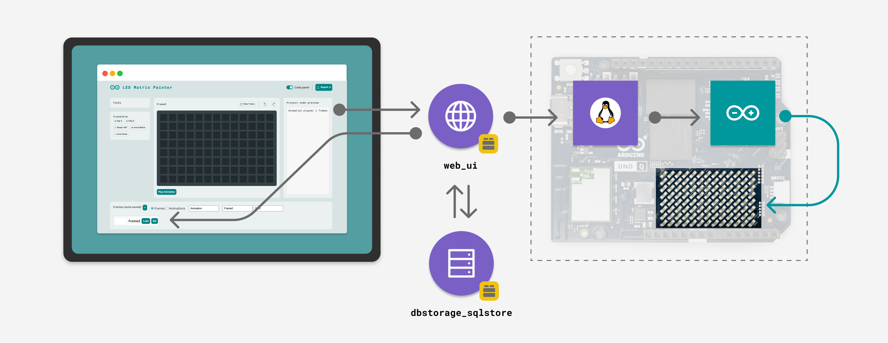

# LED Matrix Painter — Modified Version

This is a modified version of the **LED Matrix Painter** example app originally published in [Arduino App Lab](https://app-lab.arduino.cc/).

The original app provides a web-based pixel editor to draw frames and animations for the built-in 8×13 LED matrix of the **Arduino UNO Q**, with persistent storage and C++ code export. This version extends it with the features described below.

---

## Added Features

### Scrolling Text Marquee (`play_text`)

A new `/play_text` endpoint allows streaming a text string across the LED matrix as a smooth pixel-by-pixel marquee animation.

- Characters are rendered using a built-in 5×7 pixel font (`font.py`).
- The full text is rasterised into a single wide pixel tape; a 13-column window slides left one column per frame, producing horizontal scrolling.
- The scroll speed is controlled by the `duration_ms` parameter (milliseconds per frame).
- The animation is streamed directly to the sketch without touching the database, so it does not affect saved frames.
- The frame count is automatically capped at the sketch buffer limit (300 frames); for long strings the step size is increased accordingly.
- The frontend mirrors the scroll frames in the editor so you can see what is being played.

### Bulk Frame Duration Update

A new `/bulk_update_frame_duration` endpoint updates the duration of **all** saved frames in one operation, useful for quickly changing the playback speed of an entire animation.

---

## Known Issues

- **Animation delays below 150 ms produce erratic behaviour on the LED matrix.** The hardware does not handle very short inter-frame intervals reliably; frames may be skipped, duplicated, or displayed out of order. Keep per-frame durations at 150 ms or above for stable playback.

---

## Hardware and Software Requirements

- Arduino UNO Q (×1)
- USB-C cable for power and programming (×1)
- Arduino App Lab

---

## How to Run

1. Open the project in **Arduino App Lab** and click **Run**.
2. Access the editor in your browser at `<UNO-Q-IP-ADDRESS>:7000`.
